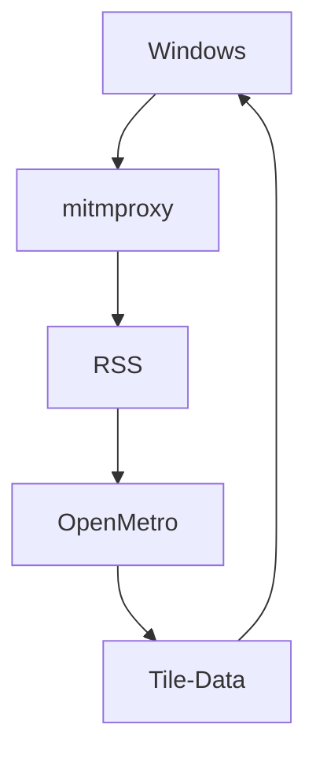

A mitmproxy script that makes some of Windows 8's Live Tiles work again.

Click to show image.

  
||
|     :---:      | 
| <i>Not all tiles are working yet, view the list below for deatils</i> |

How does it work?

  
This diagram should help.

In other words, Windows contacts mitmproxy first, mitmproxy edits the returned data which it gets from OpenMetro parsing RSS feeds.

# What is/isn't working.

> Did you know I started a blog? Check it out [here](https://boks-oks.github.io/).

#### Tiles
| Tile | Working? |
| ------------- | ------------- |
| News | Complete |
| Food | Complete |
| Finance | Not true to the original. |
| Travel | Complete |
| Games | Complete |
| Health | No |
| Maps | Not in this pre-release. |
| Weather | XML served, tile isn't working. |

#### Apps

> [!NOTE]  
> This states my progress on apps. None are working in the pre-release.

| App | Working? |
| ------------- | ------------- |
| News | No |
| Food | No |
| Finance | No |
| Travel | No |
| Games | No |
| Health | No |
| Maps | Works for a bit, then stops. |
| Weather | Shows served placeholder data, no images. |
